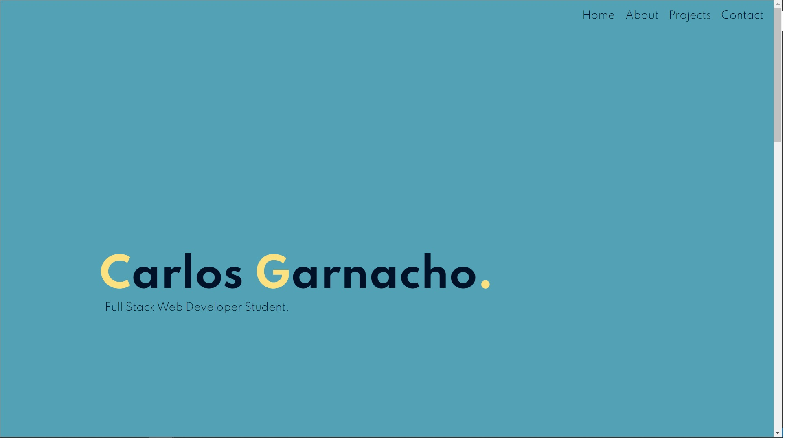
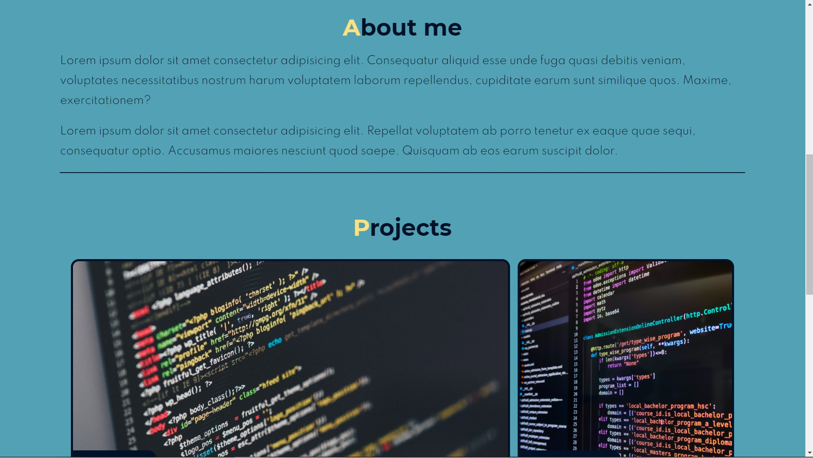
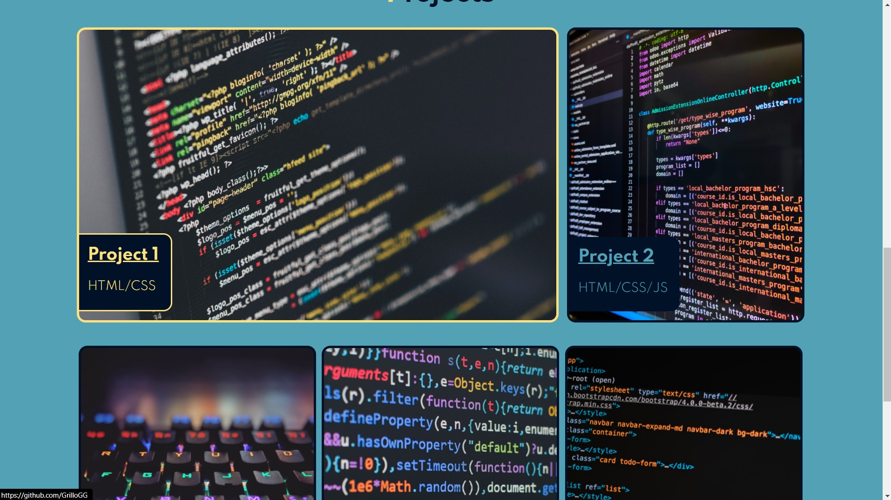
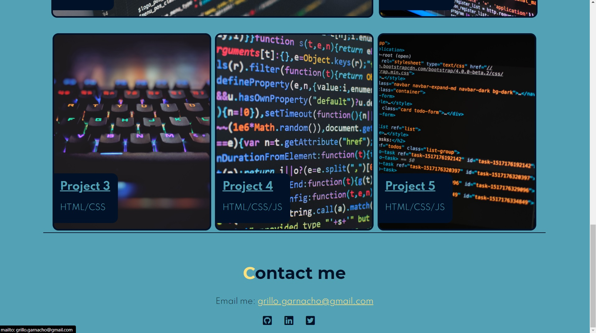

# **Portfolio - Carlos Garnacho**

This portfolio has been created using **html** and **CSS**. 

It has a html layout with a nav bar at the top, the home page, an about me section, a project section and a social media with an email at the bottom.

The nav bar will take you to the section when you clik on it.

The project cards will be updated with some projects while I am finishing my studies.

All the links to social media at the contact info section will be updated soon as well.

I have assigned some universal custom properties to be able to change the layout and the size of the text and images when using different screen sizes.

*I have used Kevin Powell's CSS variables names and the basic set up from one of his videos but the rest of the code is mine.*

---

## Website Screenshots

- Home page:

- About me:

- Projects section (while having the mouse on project 1)

- Contact me section (while having the mouse on email)

## Link to website

https://grillogg.github.io/portfolio/
